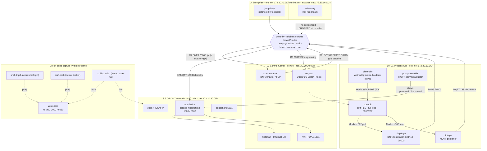

# Digital Twin Architecture — Wastewater Lift Station (DNP3 + MQTT, segmented)

**Authors:** Scrummaster (Project Management Specialists 13-1082.00), with Systems Architect
(Computer Systems Engineers/Architects 15-1299.08) and Network Architect (Computer Network
Architects 15-1241.00).
**Date:** 2026-08-14 · **Sprint:** 2 (digital-twin build-out)
**Status:** Design approved for build. Replaces the flat/loopback demo.

> **What this document is.** The architecture for a *real* multi-container **digital twin** that
> **replaces the loopback demo**. Instead of `master.py` talking to `outstation.py` over `127.0.0.1`,
> the twin is a set of Docker containers on **segmented Purdue/IEC-62443 networks** running a genuine
> closed-loop control process: a **soft-PLC (OpenPLC)** controlling a simulated **wet-well lift
> station**, fronted by a **DNP3 outstation gateway** on **TCP/20000**, supervised by a **control-center
> DNP3 master + SCADA/HMI + historian**, with an **MQTT broker + IIoT telemetry** on **TCP/1883**, an
> **engineering workstation**, an **adversary/jump host**, and an out-of-band **capture + noVNC
> Wireshark** plane so students still SEE every packet. DNP3/20000 and MQTT/1883 are **real
> container-to-container traffic across network segments — never loopback.**

**Grounding.** Scenario from `design/research_scenario.md` (water/wastewater lift station, SSO
consequence). Reference architecture, images and ports from `design/research_arch.md` (OTForge /
GRFICSv3 / OpenPLC / FUXA / Edgeshark / LinuxServer-Wireshark, all upstream-verified Aug 2026).
Segmentation model from NIST SP 800-82r3 + IEC 62443-3-2 (`research_arch.md §4`). Engineered
backstops and the "even-if" test from `design/research_cie.md`. Attack chain, ATT&CK-for-ICS
techniques and detection observables from `design/research_cyote.md`. Protocol/security-weakness
mapping from `design/research_cwe1358.md`. The existing buildable substrate (`lab/dnp3/`, `lab/mqtt/`,
`lab/zeek/`, `lab/mosquitto/`, the netns capture sidecars, the noVNC desktop on 6080) is **re-skinned,
not rebuilt** wherever possible.

---

## 0. From loopback demo to digital twin — what changes

| Aspect | CURRENT lab (`docker-compose.yml` / `.segmented.yml`) | DIGITAL TWIN (this design) |
|---|---|---|
| Control logic | none — `outstation.py` returns **canned** substation values (`BINARY=[1,1,0,0]`, `ANALOG=[13245,452,6001]`) | **OpenPLC** runs a real IEC-61131-3 **Structured-Text** wet-well level loop against a **live physics sim** |
| Physical process | implied "substation"/"tank1", not simulated | **`plant-sim`** integrates wet-well level from inflow − pump outflow; floats, weir, dead-head/dry-run all modeled |
| DNP3 | `master.py`↔`outstation.py`, often on `127.0.0.1` (loopback) | **`dnp3-gw`** (outstation addr 10) polls the PLC over Modbus and serves DNP3/20000 to **`scada-master`** across a **conduit** |
| MQTT | `publisher`→`broker`→`subscriber` on one flat net | **`iiot-gw`** publishes to a **broker in the OT-DMZ**; historian/HMI subscribe **across a conduit** |
| Segmentation | flat `otlan/24`, or a 2-zone teaching split | **5 zones + a conduit firewall** (`zone-fw`, nftables deny-by-default) = IEC 62443-3-2 |
| HMI | `subscriber.py` prints text | **FUXA** web SCADA/HMI (Modbus to PLC **and** MQTT to broker) — one operator "view" |
| Engineering / adversary | `dnp3-attacker`, `mqtt-attacker` containers | dedicated **`eng-ws`** (legit) and **`adversary`/`jump-host`** (red-team) with realistic reachability |
| Visibility | tcpdump sidecars + noVNC Wireshark on `lo` | same sidecars **per-host + at the conduit**, **Edgeshark** live click-capture, **noVNC Wireshark** reading real inter-container pcaps |

The teaching contract is preserved: everything remains **plaintext and Zeek/ICSNPP-parseable**, so the
capture, the `dnp3*.log`/`mqtt*.log` outputs, and the kit's Levels 0→6 curriculum still apply — but now
against a coherent, physically-consequential process instead of canned bytes on loopback.

---

## 1. The physical process the PLC simulates

A remote **municipal wastewater lift (pumping) station** (`research_scenario.md §1`). Sewage arrives by
gravity into a below-grade **wet well**; a PLC runs closed-loop **level control** over two duty/standby
submersible pumps that push flow into a pressurized **force main**. The **consequence of concern** is a
**wet-well overflow → Sanitary Sewer Overflow (SSO)** — a raw-sewage release (EPA point-source
violation). This is the **Maroochy Shire (2000)** consequence, recreatable frame-for-frame.

### 1.1 Plant + instrument list (`[TWIN]` tags from `research_scenario.md §2`)

| Tag | Device | Signal | Role |
|---|---|---|---|
| **LT-101** | wet-well level transmitter | 4–20 mA, 0–3.0 m | primary PV the PLC controls (spoof target) |
| **LSHH-102** | **high-high float switch** | dry contact, **hardwired** | analog backstop — starts standby pump at 95% **independent of the PLC** |
| **LSL-103** | low-level float | dry contact | dry-run cutout |
| **FIT-104** | force-main flow meter | 4–20 mA | confirms pumps move flow (dead-head/dry-run detect) |
| **PIT-105** | discharge pressure | 4–20 mA | high ⇒ closed valve/dead-head |
| **P-1 / P-2** | submersible pumps (~50 hp, ~1,500 gpm) | via VFD/soft-starter | the actuators the PLC starts/stops |
| **49/50** | motor-protection relay | overload/phase-loss/underload | trips a pump on fault; underload ≈ dry-run |
| **weir** | emergency overflow weir → equalization basin | mechanical | bounds the release path (last resort before SSO) |

### 1.2 The control loop OpenPLC runs (autonomous, local)

Textbook wet-well level control with a **deadband** (prevents short-cycling), **duty/standby
alternation** (equalizes wear), a **high-level alarm**, and **dry-run/dead-head interlocks**
(`research_scenario.md §3`). Setpoints as % of 3.0 m usable:

```
LAG_START=80%   LEAD_START=60%   STOP=20%   LOWCUT=10%   HLA=90%   HHLL(float)=95%

scan (500 ms):
  level = LT-101
  if level >= LEAD_START: start(lead_pump)
  if level >= LAG_START:  start(lag_pump)
  if level <= STOP:       stop(all); alternate_lead()
  if level <= LOWCUT or LSL-103==dry: inhibit_start        # DRY-RUN protection
  if pump_running and flow < MIN_FLOW and psi > HI_PSI: trip; alarm   # DEAD-HEAD protection
  if level >= HLA: set HIGH_LEVEL_ALARM (DNP3 BI + MQTT alarm)
  # comms-loss safe behavior: keep pumping locally on last-known setpoints (fail-operational)
```

Key properties taught: the loop is **autonomous** (pumps the well down even with SCADA/broker
unreachable), the master only **supervises/adjusts setpoints**, and the **hardwired float + weir** hold
even if DNP3+MQTT are fully owned.

### 1.3 How the physics is made real — `plant-sim` ↔ OpenPLC

`plant-sim` is a small Python container (same pattern as `lab/mqtt/*.py`) that integrates the tank and
exposes I/O as a **Modbus/TCP slave**; **OpenPLC is the Modbus master** that polls it (OpenPLC v3
"slave devices" remote-I/O feature). This is the GRFICSv3 pattern — logic in the PLC, physics in a sim,
a real fieldbus between them.

```
wet-well model (per 500 ms tick):
  Q_in   = diurnal_base(t) + storm_pulse(t)              # uncontrolled inflow, gpm
  Q_out  = (P1_run + P2_run) * 1500 * pump_efficiency    # pumped outflow, gpm
  level += (Q_in - Q_out) * dt / WETWELL_AREA            # integrate, clamp 0..100%
  FIT-104 = Q_out ; PIT-105 = f(Q_out, valve_state)      # derived signals
  LSHH-102 = (level >= 95%) ; LSL-103 = (level > LOWCUT) # float discretes (HARDWIRED path)
  if level >= 100%:  spill += (Q_in - Q_out)*dt          # ← SSO consequence counter
```

**Modbus I/O map (the L0↔L1 image, mirrored 1:1 into the DNP3 point map of §5):**

| OpenPLC var | Modbus | Signal | Dir |
|---|---|---|---|
| `%IW100` | input reg 100 | LT-101 level (0–10000 = 0–100.00%) | sim→PLC |
| `%IW101` | input reg 101 | FIT-104 flow (gpm) | sim→PLC |
| `%IW102` | input reg 102 | PIT-105 pressure (psi) | sim→PLC |
| `%IX100.0` | discrete in | LSHH-102 high-high float | sim→PLC |
| `%IX100.1` | discrete in | LSL-103 low float | sim→PLC |
| `%QX100.0` | coil 0 | P-1 start | PLC→sim |
| `%QX100.1` | coil 1 | P-2 start | PLC→sim |
| `%QX100.2` | coil 2 | HLA (alarm lamp / DNP3 BI feed) | PLC→sim |
| `%MW10` | hold reg 10 | **LEAD_START setpoint** (writable) | DNP3 g41 / MQTT target |
| `%MW11` | hold reg 11 | STOP setpoint (writable) | setpoint target |

The **hardwired high-high float** is modeled as a path `plant-sim` honors **regardless of `%QX` coils**:
at 95% it force-starts the standby pump and raises the local horn even if the PLC commands both pumps
off — the CIE analog backstop (`research_cie.md` #2/#10), the single most important control against the
§7 attack.

---

## 2. Topology

### 2.1 Mermaid



### 2.2 ASCII fallback

```
 RED-TEAM            ENTERPRISE L4            OT-DMZ L3.5                  CONTROL CENTER L3
 attacker_net        ent_net                  dmz_net                     control_net
 172.30.66/24        172.30.40/24             172.30.30/24                172.30.20/24
 [adversary]         [jump-host]              [mqtt-broker 1883/8883]     [scada-master/FEP]
      \                    \                   [zeek+ICSNPP] [edgeshark]   [hmi FUXA 1881]
       \                    \                        |                     [historian] [eng-ws]
        \                    \                       |                          |
         \-------------\      \------------\    +----+----+   /----------------/
                        \                   \   |         |  /
                         \================ [ zone-fw : nftables deny-by-default ] ============
                                                |   (multi-homed to ALL zones; the only router) |
                          conduits:  C1 DNP3/20000 (master<->gw)  C2 MQTT/1883 (iiot->broker->hist/hmi)
                                      C3 eng 8080/502 (eng-ws->plc)
                                                |
                          ======================+========================
                          PROCESS CELL L0-L1  cell_net 172.30.10/24
                          [plant-sim]--Modbus502-->[openplc 8080/502]--Modbus-->[dnp3-gw 20000]
                                                        |  \--Modbus-->[iiot-gw]--MQTT-->(C2)
                                                        \--(hardwired HH float path, PLC-independent)
                          [pump-controller] <--MQTT-- (broker)
   CAPTURE PLANE (out-of-band): sniff-dnp3(netns:dnp3-gw) sniff-mqtt(netns:broker)
                                sniff-conduit(netns:zone-fw) --> ./captures --> [wireshark noVNC 6080]
```

---

## 3. Container inventory

Networks reference the zones defined in §4. "Image" cites the upstream from `research_arch.md`; "build
./x" reuses this kit's existing Dockerfiles.

| # | Container | Purdue / role | Image | Network(s) | Why it exists |
|---|---|---|---|---|---|
| 1 | **plant-sim** | L0 field I/O — wet-well **physics** | `python:3.11-slim` (build, new; mirrors `lab/mqtt`) | `cell_net` | Makes the process real: integrates level from inflow−outflow, drives floats/weir, counts the SSO spill. Modbus **slave** to the PLC. |
| 2 | **openplc** | L1 **soft-PLC** — the control logic | build `thiagoralves/OpenPLC_v3` (`research_arch.md §1`) | `cell_net` | Runs the IEC-61131-3 **ST** wet-well loop; Modbus **master** to plant-sim; Modbus **server 502** for the gateway/HMI; web UI **8080**. |
| 3 | **dnp3-gw** | L1 **DNP3 outstation gateway** fronting the PLC | build `./dnp3` (kit `outstation.py`, remapped) or `dnp3-python` | `cell_net` (+netns tap) | Protocol-converter RTU: polls the PLC over Modbus, presents **DNP3 outstation addr 10 on TCP/20000** to the SCADA master. The "gateway fronting the PLC." |
| 4 | **iiot-gw** | L2 **IIoT/MQTT edge gateway** — telemetry | build `./mqtt` (kit `publisher.py`, remapped) | `cell_net` | Reads plant state, **PUBLISHes** `plant/tank1/telemetry|status` to the broker — the condition-monitoring/observe path (rides *alongside* DNP3). |
| 5 | **pump-controller** | L1/L2 **MQTT-obeying actuator** | build `./mqtt` (kit `pump-controller.py`) | `cell_net` | The "trusting subscriber" that executes `plant/tank1/command` — makes the insecure **cloud-command** path physically consequential (teaching surface; CIE says this should be read-only). |
| 6 | **mqtt-broker** | L3.5 **MQTT broker** | `eclipse-mosquitto:2` (kit `lab/mosquitto/`) | `dmz_net` | IIoT aggregation point in the OT-DMZ. `insecure.conf` (default) vs `secure.conf`+`acl` (hardened) is the MQTT security lesson. |
| 7 | **scada-master** | L3 **DNP3 master / front-end processor** | build `./dnp3` (kit `master.py`, extended) | `control_net` | The utility control-center master: integrity polls, receives unsolicited events, issues supervised **SELECT→OPERATE** control and **g41** setpoint writes over DNP3/20000. |
| 8 | **hmi** | L3 **SCADA / HMI** (the operator view) | `frangoteam/fuxa` (`research_arch.md §2`) | `control_net` | Web HMI spanning **both** kit protocols: Modbus to OpenPLC + MQTT to the broker. Renders level/pumps/alarms — the "view" the attacker spoofs. |
| 9 | **historian** | L3 **historian** | `influxdb:1.8` (OTForge stack) or python logger | `control_net` | Time-series store of DNP3/MQTT telemetry; the baseline that "commanded ≠ reported" anomalies are measured against. |
| 10 | **eng-ws** | L3 **engineering workstation** | `lscr.io/linuxserver/*` (KasmVNC) or build w/ OpenPLC Editor | `control_net` | Legit engineering: programs OpenPLC (8080), loads ST, configures the outstation. The asset an IT-side attacker pivots *through*. |
| 11 | **zone-fw** | L3 **conduit firewall / router** | `nftables` on `alpine`/`debian` (build) | **all zones** (multi-homed) | Enforces **IEC 62443-3-2 zones-and-conduits**: deny-by-default routing, explicit per-conduit allow rules (§4.2). Also the single **conduit tap** (§6). |
| 12 | **jump-host** | L4 **enterprise jump box** | `nicolaka/netshoot` | `ent_net` | Models the IT foothold / external-remote-services entry (Colonial/Oldsmar precursor). Has ping/nc for reachability demos. |
| 13 | **adversary** | red-team | `kalilinux/kali-rolling` or `netshoot`+kit scripts | `attacker_net` (+ scenario-granted cell foothold) | Runs the §7 attack chain (rogue DNP3 master, spoofed unsolicited, MQTT injection). Blocked at the conduit until granted a cell foothold — the segmentation lesson. |
| 14 | **zeek** | analysis — **Zeek + CISA ICSNPP** | build `./zeek` (kit) | `dmz_net` / capture | Parses pcaps (or live at the conduit) → `dnp3.log`, `dnp3_control.log`, `dnp3_objects.log`, `mqtt_*.log`. The detection core. |
| 15 | **sniff-dnp3** | capture sidecar | `nicolaka/netshoot` (kit) | `network_mode: service:dnp3-gw` | tcpdump of **TCP/20000** at the RTU → `./captures/dnp3_live.pcap`. |
| 16 | **sniff-mqtt** | capture sidecar | `nicolaka/netshoot` (kit) | `network_mode: service:mqtt-broker` | tcpdump of **1883/8883** at the broker → `./captures/mqtt_live.pcap`. |
| 17 | **sniff-conduit** | capture sidecar (SPAN-like) | `nicolaka/netshoot` | `network_mode: service:zone-fw` | Whole-conduit tap — every inter-zone packet, the digital SPAN at the OT/DMZ boundary. |
| 18 | **wireshark** | **noVNC Wireshark** visibility | `lscr.io/linuxserver/wireshark` (`research_arch.md §5.5`) | `span_net` / netns; or kit noVNC desktop **6080** | Students **SEE** packets: opens the live sidecar pcaps and/or captures live on a shared segment. |
| 19 | **edgeshark** | live click-to-Wireshark | `ghcr.io/siemens/edgeshark` (`research_arch.md §5.3`) | `dmz_net` (+host netns for discovery) | Web UI on **5001**; click any container interface → live-stream into desktop Wireshark via `cshargextcap`. |

Containers 5, 9, 10, 12, 19 are **optional profiles** (`--profile twin-full`) so a laptop can run the
core twin (1–4, 6–8, 11, 14–18) and add enterprise/red-team/HMI depth on demand — the same
profile pattern the current lab uses (`attack|tools|capture`).

---

## 4. Segmented networks + zones-and-conduits (IEC 62443-3-2)

### 4.1 Zones (one user-defined Docker bridge per zone)

| Zone (IEC 62443) | Purdue level | Docker network | Subnet | Members |
|---|---|---|---|---|
| **Process cell** | L0–L1 | `cell_net` | 172.30.10.0/24 | plant-sim, openplc, dnp3-gw, iiot-gw, pump-controller |
| **Control center** | L3 | `control_net` | 172.30.20.0/24 | scada-master, hmi, historian, eng-ws |
| **OT-DMZ** | L3.5 | `dmz_net` | 172.30.30.0/24 | mqtt-broker, zeek, edgeshark |
| **Enterprise** | L4 | `ent_net` | 172.30.40.0/24 | jump-host |
| **Red-team** | — | `attacker_net` | 172.30.66.0/24 | adversary |
| **Capture/OOB** | — | netns + `span_net` | (no L3 addr) | wireshark, sniff-* sidecars |

Docker's native inter-network isolation means containers on different bridges **cannot talk at all**
unless a **multi-homed container routes between them**. That router is **`zone-fw`**, which has a leg in
every zone, runs `ip_forward=1`, and every other container's default route points at its in-zone
`zone-fw` address. Result: **all inter-zone traffic is forced through `zone-fw`**, exactly like a real
plant firewall between Purdue levels — and nothing crosses a boundary that `zone-fw` does not explicitly
permit.

> **Why a router-firewall rather than dual-homed conduit hosts?** The current `docker-compose.segmented.yml`
> teaches the minimal case (the FEP `dnp3-master` is the *only* dual-homed host = the only conduit). This
> design keeps that lesson but upgrades enforcement to an **explicit deny-by-default nftables ruleset**
> (the OTForge IEC-62443-3-2 pattern, `research_arch.md §4`): a *conduit* becomes a named allow-rule you
> can point to, audit, and break — not merely an artifact of which bridges a container happens to touch.

### 4.2 Conduits (the only sanctioned cross-zone flows)

| ID | Conduit | Allowed flow | Port | Purpose |
|---|---|---|---|---|
| **C1** | Control ⇄ Cell (DNP3) | `scada-master` ⇄ `dnp3-gw` **only** | tcp/20000 | supervisory control + polling (the regulated real-time path) |
| **C2** | Cell → DMZ → Control (MQTT) | `iiot-gw` → `mqtt-broker`; `historian`,`hmi` → `mqtt-broker` | tcp/1883 (8883) | IIoT telemetry up (observe/analytics); **command/setpoint down is *denied* by design** = data-diode intent (CIE #2) |
| **C3** | Control → Cell (engineering) | `eng-ws` → `openplc` | tcp/8080, 502 | PLC programming / outstation config |
| **C4** | Enterprise → DMZ | `jump-host` → `mqtt-broker`/`edgeshark` | tcp/1883,5001 | enterprise visibility only; **no path to `cell_net`** |
| — | Red-team → anywhere | *(none)* | — | **deny-by-default**: the adversary has no conduit into the cell |

Illustrative `zone-fw` nftables (deny-by-default forward chain; the conduits are the allow rules):

```nft
table inet conduits {
  chain forward {
    type filter hook forward priority 0; policy drop;      # IEC 62443: deny-by-default
    ct state established,related accept

    # C1 DNP3 control conduit — ONLY the master<->outstation pair, only :20000
    ip saddr 172.30.20.0/24 ip daddr 172.30.10.0/24 tcp dport 20000 accept
    ip saddr 172.30.10.0/24 ip daddr 172.30.20.0/24 tcp sport 20000 accept

    # C2 MQTT telemetry conduit — cell->broker, and control->broker; up only
    ip saddr 172.30.10.0/24 ip daddr 172.30.30.30 tcp dport { 1883, 8883 } accept
    ip saddr 172.30.20.0/24 ip daddr 172.30.30.30 tcp dport { 1883, 8883 } accept

    # C3 engineering conduit — eng-ws -> openplc only
    ip saddr 172.30.20.0/24 ip daddr 172.30.10.11 tcp dport { 8080, 502 } accept

    # C4 enterprise -> DMZ visibility only (no cell)
    ip saddr 172.30.40.0/24 ip daddr 172.30.30.0/24 tcp dport { 1883, 5001 } accept

    log prefix "CONDUIT-DROP " drop            # everything else logged + dropped (tripwire feed)
  }
}
```

The `CONDUIT-DROP` log line is itself an **Active Defense tripwire** (CIE #6): an adversary in the DMZ
or enterprise probing `cell_net:20000` shows up as a dropped-flow log the moment they try — the
"attack dies at the conduit" that the segmented exercise already teaches, now instrumented.

---

## 5. End-to-end data flows

### F1 — Autonomous control loop (L0↔L1, Modbus)
`plant-sim` integrates the wet well → publishes `%IW100..102` + float discretes (Modbus slave) →
`openplc` (Modbus master) reads them, runs the §1.2 ST deadband loop, writes pump coils `%QX100.0/.1`
and HLA `%QX100.2` → `plant-sim` reads the coils, applies pump outflow, re-integrates. **This loop runs
continuously and independently** — the well pumps down even if every upstream zone is dead
(fail-operational, `research_scenario.md §3`).

### F2 — DNP3 supervisory (L1→L3, TCP/20000, across conduit C1)
`dnp3-gw` mirrors the PLC's Modbus image into its DNP3 static database. `scada-master` issues an
**integrity poll** — `READ` (fc **0x01**) of Class 1/2/3/0 — and `dnp3-gw` answers **RESPONSE 0x81**
with the water point map below; on a new HLA it sends **UNSOLICITED 0x82** (report-by-exception).
Supervised control is **SELECT 0x03 → OPERATE 0x04** of a **g12v1 CROB** (start/stop a pump); setpoint
change is a **WRITE of g41** Analog Output. All real between containers, parsed by ICSNPP into
`dnp3.log` + `dnp3_control.log` + `dnp3_objects.log`.

**DNP3 point map (`[TWIN]`, `research_scenario.md §4` — mirrors the §1.3 Modbus image):**

| DNP3 object | Idx | Point |
|---|---|---|
| g1 Binary Input | 0/1/2/3 | P-1 run · P-2 run · **HLA** (spoof bit) · pump fault |
| g30 Analog Input | 0/1/2 | **wet-well level %** (LT-101, spoof target) · flow gpm · psi |
| g12v1 CROB | 0/1 | **P-1 start/stop** · P-2 start/stop (TRIP=stop / CLOSE=start) |
| g41 Analog Output | 0/1 | **LEAD_START setpoint** (Oldsmar "modify parameter" target) · STOP setpoint |

### F3 — MQTT telemetry (L2→L3.5→L3, TCP/1883, across conduit C2)
`iiot-gw` PUBLISHes to the broker; `historian` + `hmi` SUBSCRIBE. Topic tree reuses the kit's exactly
(`research_scenario.md §5`):

| Topic | Dir | QoS | Payload |
|---|---|---|---|
| `plant/tank1/telemetry` | GW→cloud | 0/1 | `{"level_pct":42,"flow_gpm":1490,"p1":"RUN","p2":"STOP","psi":31}` |
| `plant/tank1/status` | GW→cloud | 1, retained | pump/alarm/health |
| `plant/tank1/setpoint` | cloud→GW | 1 | `{"lead_start":60,"stop":20}` — **denied by C2/ACL by design** |
| `plant/tank1/command` | cloud→GW | 1 | `{"actuator":"pump1","cmd":"STOP"}` — the actuator `pump-controller` obeys |

Zeek's MQTT analyzer emits `mqtt_connect.log`/`mqtt_publish.log`/`mqtt_subscribe.log`. Default payloads
are **plain JSON** (fully wire-readable); Sparkplug-B is an optional realism mode (envelope visible,
protobuf body opaque — a documented teaching caveat).

### F4 — HMI view (L3)
`hmi` (FUXA) reads `openplc` over Modbus (through a C3-style allow) and the broker over MQTT, rendering
level/pump/alarm. **This is the operator's perception** — the thing the §7 attack must mask.

### F5 — Engineering (L3→L1, conduit C3)
`eng-ws` programs `openplc` (web 8080, ST upload) and configures `dnp3-gw`. This is the only sanctioned
write path into the cell besides C1 control.

### F6 — Attack flows (adversary) — see §7.

---

## 6. Packet capture & Wireshark visualization

Docker bridges have **no native SPAN/mirror**, so the twin uses **three complementary, upstream-verified
techniques** (`research_arch.md §5`) and surfaces them in a **noVNC Wireshark** the student watches in a
browser. All produce **Zeek-ready pcaps** in the shared `./captures` volume.

### 6.1 Method A — per-host netns tap (precise, the kit's proven method)
A sniffer joins the target's network namespace and captures exactly that host's traffic:

```yaml
sniff-dnp3:
  image: nicolaka/netshoot
  network_mode: "service:dnp3-gw"            # share the RTU's netns
  cap_add: [NET_ADMIN, NET_RAW]
  command: tcpdump -i any -U -w /caps/dnp3_live.pcap "tcp port 20000"
  volumes: ["./captures:/caps"]
sniff-mqtt:
  image: nicolaka/netshoot
  network_mode: "service:mqtt-broker"
  cap_add: [NET_ADMIN, NET_RAW]
  command: tcpdump -i any -U -w /caps/mqtt_live.pcap "tcp port 1883 or tcp port 8883"
  volumes: ["./captures:/caps"]
```

### 6.2 Method B — conduit / whole-zone tap (SPAN-like)
Because **all inter-zone traffic crosses `zone-fw`**, a sidecar sharing `zone-fw`'s netns
(`sniff-conduit`) sees **every cross-conduit packet at once** — the digital equivalent of a SPAN port at
the OT/DMZ boundary, the natural sensor feed for Zeek/ICSNPP and Suricata. (Host-side
`tcpdump -i br-xxxxxxxx` on a zone's Linux bridge, found via `docker network inspect cell_net`, gives
the same whole-zone view from the host.)

### 6.3 Method C — Edgeshark live click-to-Wireshark
`edgeshark` (Siemens, MIT) exposes a web UI on **5001**; with the `cshargextcap` extcap plugin installed,
the student clicks **any container interface** and a **live capture streams straight into desktop
Wireshark** — no pcap file, no restart. Ideal for "show me `dnp3-gw`'s traffic right now."

### 6.4 Visualizing in Wireshark (noVNC) — how the student SEES packets
Two interchangeable front-ends, both browser-based:

- **Standalone `wireshark` container** — `lscr.io/linuxserver/wireshark`, noVNC GUI on **3000/3001**,
  `--cap-add=NET_ADMIN`. Run it either (a) with `./captures` mounted so **File ▸ Open** the rolling
  `*_live.pcap` (auto-reloads as packets arrive), or (b) with `network_mode: "service:zone-fw"` so its
  **Capture ▸ eth0** watches live conduit traffic directly.
- **Kit noVNC desktop on port 6080** (already in `.devcontainer/`, `DISPLAY :1`) — the existing
  `lab/open-wireshark.sh` launcher, pointed at the real inter-container pcaps instead of `lo`.

**Standard capture/display filters** (unchanged from the kit, so the curriculum transfers):
- capture filter: `tcp port 20000 or tcp port 1883 or tcp port 8883`
- display filter: `dnp3 || mqtt` — then drill in with `dnp3.al.func`, `dnp3.al.ctrl.code`,
  `mqtt.msgtype`, `mqtt.topic`.

**Feed to detection:** the Method-A/B pcaps → `zeek` + CISA **ICSNPP** → `dnp3*.log` / `mqtt*.log`
(kit `lab/zeek/local.zeek` already `@load icsnpp-dnp3`). Optional Suricata (ET-ICS rules) on the same
`sniff-conduit` tap adds the signature-IDS half.

> **Placement discipline (CIE #6).** Every tap is **passive and out-of-band** — netns-shared or
> reading the shared volume — **never inline on the DNP3/MQTT control path**. Monitoring observes; it
> can never delay or drop a control packet.

---

## 7. The scenario attack + engineered backstops (the point of the twin)

### 7.1 Attack chain (wire-observable, `research_scenario.md §6`, ATT&CK-for-ICS)
The adversary reaching the SSO consequence executes, in order:
1. **Loss of view** — flood **spoofed DNP3 `0x82` unsolicited** reporting level=LOW / HLA=clear, and
   **publish spoofed `plant/tank1/telemetry`** low → HMI shows "normal." *(T0856 Spoof Reporting Message,
   T0829 Loss of View.)*
2. **Manipulation of control** — **CROB OPERATE/DIRECT_OPERATE (0x04/0x05)** to **stop both pumps**,
   and/or **MQTT `plant/tank1/command` `{"cmd":"STOP"}`** (which `pump-controller` executes). *(T0855,
   T0831.)*
3. **Modify parameter (Oldsmar)** — **WRITE g41 / publish `plant/tank1/setpoint`** to push LEAD_START
   above 100% so pumps never start. *(T0836.)*
4. **Result** — inflow keeps arriving, pumps stay off, level rises past HLA and the weir → **SSO**,
   perceived by no one because step 1 masked the view. *(T0826 Loss of Availability.)* Optional escalation:
   **DNP3 `0x0D COLD_RESTART`** of the RTU.

### 7.2 Where segmentation stops it
From `attacker_net` or `ent_net` the adversary has **no C1/C2/C3 conduit into `cell_net`**: DNP3 packets
to `dnp3-gw:20000` are **dropped and logged at `zone-fw`** (`CONDUIT-DROP`). The attack only proceeds
once the scenario **grants a cell foothold** (e.g., a compromised `iiot-gw`) — teaching that the same
payload succeeds L2-adjacent to the RTU and fails from the DMZ, exactly the current segmented lesson,
now against a live process.

### 7.3 CIE engineered backstops — the "even-if" acceptance test (`research_cie.md` #2/#5/#10)
Even with **full DNP3+MQTT write access**, the SSO must remain bounded, because non-digital layers hold:

| Backstop | Modeled in | Effect |
|---|---|---|
| **Hardwired high-high float (LSHH-102)** wired to the pump starter | `plant-sim` (PLC-independent path) | starts the standby pump + horn at 95% **regardless of `%QX` coils, DNP3, or MQTT** — the single most important control |
| **Mechanical overflow weir** → equalization basin | `plant-sim` spill model | bounds the release path before an unbounded SSO |
| **Motor-protection relay** underload + VFD low-flow trip | `plant-sim` interlock | caps dead-head/dry-run damage at a setpoint no register overrides |
| **Check valves** per pump | `plant-sim` | mitigate water hammer on stop |
| **Data-diode intent** on MQTT egress (C2 up-only) + DNP3 **SAv5** + MQTT **mTLS/ACL** | `zone-fw` C2, `mosquitto.secure.conf`+`acl`, SAv5 lesson | telemetry observes; `command`/`setpoint` from the cloud/wildcard/foreign publisher is refused |

**Acceptance test (CIE #10):** run §7.1 with full write access — the well **still** pumps down at the
high-high float and cannot cause an unbounded SSO. The twin passes only if the analog layer holds while
every digital layer is owned.

---

## 8. Standards & detection overlay (how the twin teaches)

**CyOTE perception→detection→attribution** (`research_cyote.md`) mapped to twin observables:

| Observable (Zeek/ICSNPP field) | Anomaly | ATT&CK-for-ICS | Phase |
|---|---|---|---|
| 2nd DNP3 source to outstation 10; control from a never-before IP (`dnp3.log id.orig_h`) | rogue master | T0848, T0855 | Middle |
| `dnp3.al.func==0x82` from unexpected src; reported level ≠ expected | spoofed view | T0856, T0829 | Middle→Late |
| `dnp3_control.log` CROB `Trip`/stop both pumps, command-rate spike | manip. of control | T0831, T0806 | Late |
| `dnp3_objects.log` g41 write / MQTT `setpoint` outside engineering band | modify parameter | T0836 | Late |
| `mqtt_subscribe.log` topic `#`, or PUBLISH to `command`/`setpoint` | rogue publisher/harvest | T0831, T0802 | Middle |
| `dnp3.al.func==0x0D` cold restart | availability | T0816 | Impact |

**CWE-1358 anchors** (`research_cwe1358.md`, direct View-1358 members) per link: DNP3/20000 —
**CWE-306** (missing auth for control), **CWE-319** (cleartext), **CWE-290** (spoofing), **CWE-349**
(unsolicited/extraneous data). MQTT/1883 — **CWE-306** (anonymous), **CWE-319**, **CWE-284/1369** (no
ACL, wildcard `#`), **CWE-311/1393**. Conduit — **CWE-1364** (zone-boundary), **CWE-807** (trusting
spoofed reported state). These are the exact weaknesses the segmentation + SAv5 + mTLS/ACL controls close.

**Curriculum fit:** the twin drives the kit's existing Levels 0→6 — endpoints/ports (L1–2), function-code
and topic analysis (L3), "odd-one-out" anomaly/attribution (L4), and the capstone Machine Problem (L5–6)
— now against a live, consequential process instead of a static pcap.

---

## 9. Build & migration outline

**Compose files.** Add `lab/docker-compose.twin.yml` (this design) alongside the existing two; keep
`docker-compose.yml` (flat teaching) and `docker-compose.segmented.yml` (2-zone minimal) untouched.
Profiles: default = core twin; `--profile twin-full` adds historian/eng-ws/jump-host/edgeshark;
`--profile attack` adds the adversary + granted foothold; `--profile capture` adds the sniff sidecars;
`--profile tools` adds zeek.

**Bring-up order** (depends_on): `plant-sim` → `openplc` (load ST, enable Modbus master + DNP3/Modbus
servers) → `dnp3-gw`, `iiot-gw` → `mqtt-broker`, `zone-fw` (apply nftables) → `scada-master`, `hmi`,
`historian` → capture plane → (on demand) `eng-ws`, `jump-host`, `adversary`.

**Reuse map (re-skin, don't rebuild).** `dnp3-gw` = `lab/dnp3/outstation.py` remapped to the §5 water
points + g41 setpoints; `iiot-gw` = `lab/mqtt/publisher.py` with water fields; `pump-controller`,
`scada-master`, `mqtt-broker`, `zeek`, `sniff-*`, `mosquitto.*.conf`+`acl` = **as-is**. New builds:
`plant-sim` (small, mirrors `lab/mqtt` Dockerfile), `openplc` (upstream `OpenPLC_v3`), `zone-fw`
(nftables), and the `hmi`/`historian`/`eng-ws`/`edgeshark`/`wireshark` upstream images.

**New this sprint (net-new work):** the OpenPLC ST wet-well program (§1.2), the `plant-sim` physics
(§1.3), the Modbus↔DNP3 mirror in `dnp3-gw`, the `zone-fw` nftables conduits (§4.2), and wiring the
noVNC/Edgeshark visibility at the conduit (§6). Everything else is a relabel of existing containers.

---

## 10. Sources / provenance
- Scenario, physical process, point maps, attack chain, CIE backstops — `design/research_scenario.md`.
- Reference architectures (OTForge, GRFICSv3, DHALSIM), images/ports (OpenPLC_v3, FUXA, eclipse-mosquitto,
  Edgeshark, LinuxServer-Wireshark, nicolaka/netshoot), segmentation model, capture techniques —
  `design/research_arch.md`.
- Zones-and-conduits / defense-in-depth — NIST SP 800-82r3, IEC 62443-3-2/3-3 (via `research_arch.md §4`).
- Engineered controls, hierarchy of controls, "even-if" acceptance test — `design/research_cie.md`.
- Perception→detection→attribution, ATT&CK-for-ICS techniques, Maroochy/Oldsmar anchors —
  `design/research_cyote.md`.
- Protocol/security-weakness mapping (CWE-1358 / CWE-1366 etc.) — `design/research_cwe1358.md`.
- Buildable substrate — `lab/dnp3/`, `lab/mqtt/`, `lab/mosquitto/`, `lab/zeek/`,
  `lab/docker-compose*.yml`, `.devcontainer/` (noVNC on 6080).

> **Provenance note.** Upstream images/ports are cited to the verified `research_arch.md` pass (Aug 2026);
> DNP3/20000 and Modbus/502 are the protocols' standard ports. Point indices, setpoints, subnets
> (172.30.x), and the nftables ruleset are **engineering choices for this twin** (`[TWIN]`) — realistic
> and internally consistent, not quoted from any one plant. Nothing here is weaponized; attacker steps
> are described only at the protocol-observable level for a defensive lab.
```
